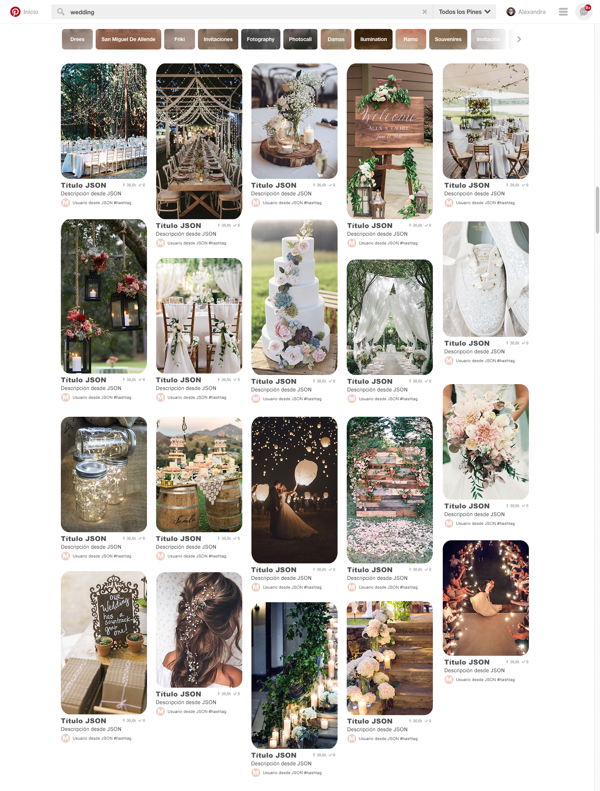

# Pinterest
Final Project using Galp

### Contents
- [Ambiente de desarrollo](#desarrollo)
- [Requerimientos Tecnicos](#Requerimientos)
- [Dependencias](#dependencias)

### Ambiente de Desarrollo 
- Clonar repositorio
- Posicionado en la carpeta que contiene el proyecto, correr npm install  para descargar y utilizar todas las dependencias utilizadas
- Correr Gulp para que se realizen las tareas especificadas 

### Requerimientos Técnicos
- El proyecto ha sido desarrollado con las siguientes especificaciones:

### Dependencias 
- Gulp -v.3.9.1
- Gulp-concat -v.2.6.1
- Gulp-Minify-CSS  -v.1.2.4
- Gulp-Sass -v.3.1.0
- Gulp-Uglify -v.3.0.0
- Gulp-livereload -v.3.8.1
- Gulp-webServer -v.0.9.1
- node-font-awesome -v.1.0.2

### Dependencias de Producción
- jquery: -v.3.2.1,
- materialize-css: -v.0.100.1
- fontAwesome: -v 4.7.0
